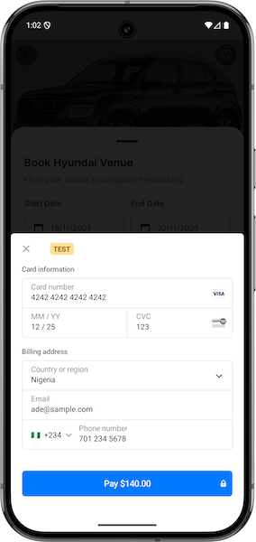

# Car Rental

A modern, feature-rich Flutter mobile application for premium car rentals with **FREE OpenStreetMap integration** (no API key required!).

## Features

* Modern UI - Clean, elegant design with dark/light themes
<<<<<<< HEAD
* FREE Maps - OpenStreetMap integration showing Abuja, Nigeria (zero setup!)
=======
* Location Map - OpenStreetMap integration showing Abuja, Nigeria (zero setup!)
>>>>>>> 8f159bf (Refactor project structure, add .env file for payment keys, integrate stripe payment, update booking entity, and add payment entity and provider)
* Smart Search - Real-time search and category filtering
* Favorites - Save and manage favorite vehicles
* Booking System - Complete booking flow with date selection
* Booking Management - Track active, completed, and cancelled bookings
<<<<<<< HEAD
* Theme Toggle - Switch between dark and light modes
=======
* Payment - Stripe payment integration
* Dark/Light Mode - Switch between dark and light modes
* Bottom Navigation - Quickly navigate between screens
>>>>>>> 8f159bf (Refactor project structure, add .env file for payment keys, integrate stripe payment, update booking entity, and add payment entity and provider)

## Tech Stack

* Framework: Flutter
* State Management: Riverpod
* Navigation: Go Router
* Maps: Flutter Map (OpenStreetMap - FREE)
* Fonts: Google Fonts (Inter)

## Screens

1. Welcome - Onboarding with hero car image
2. Home - Browse premium vehicles
3. Detail - Car specs, features, and interactive map
4. Favorites - Saved cars
5. Booking - Complete booking history with stats
6. Profile - Settings and theme toggle

## Screenshots

  

### Light mode

  

### Dark mode

  

 
